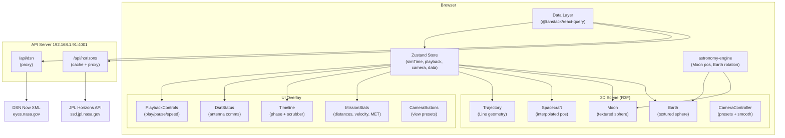
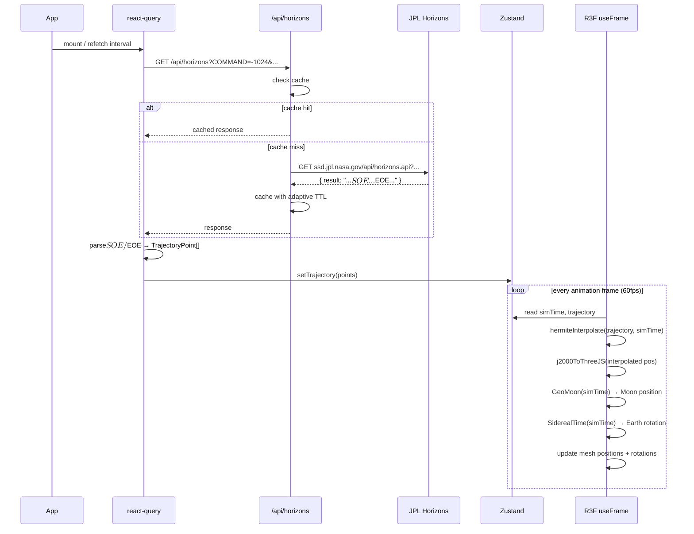
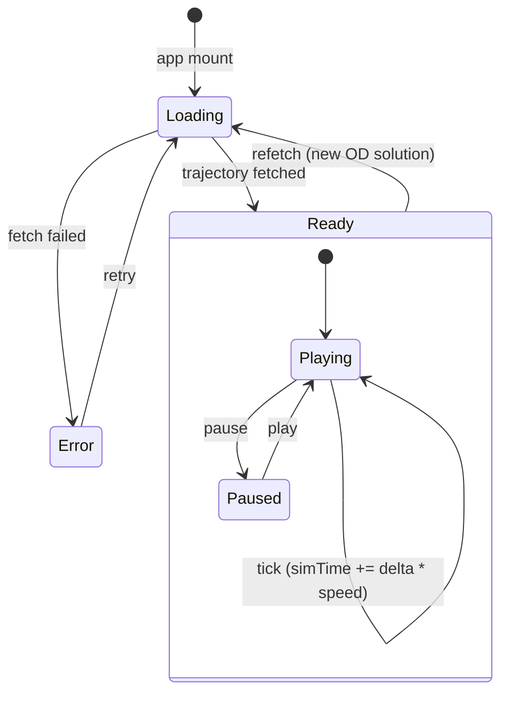
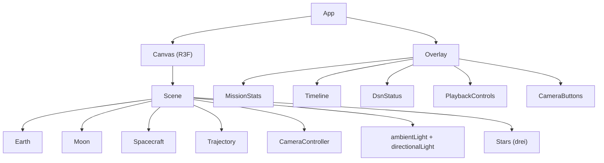
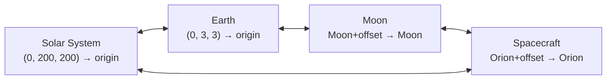

# Artemisee — Implementation Design

## System Architecture



## Data Flow



## State Machine



## Component Tree



## File Structure

```
artemisee/
├── public/
│   └── textures/
│       ├── earth-4k.jpg              # NASA Blue Marble
│       ├── moon-4k.jpg               # NASA CGI Moon Kit
│       └── starfield.jpg
├── server/
│   ├── index.ts                       # Express app entry, starts on :3001
│   ├── routes/
│   │   ├── horizons.ts                # GET /api/horizons — cache + proxy
│   │   └── dsn.ts                     # GET /api/dsn — proxy DSN XML
│   └── cache.ts                       # Simple in-memory TTL cache
├── src/
│   ├── main.tsx                       # ReactDOM.createRoot
│   ├── App.tsx                        # Canvas + Overlay layout
│   ├── store.ts                       # Zustand store
│   │
│   ├── data/
│   │   ├── types.ts                   # TrajectoryPoint, DsnDish, etc.
│   │   ├── horizons.ts                # fetchTrajectory, parseHorizons
│   │   ├── dsn.ts                     # fetchDsn, parseDsnXml
│   │   ├── interpolate.ts             # hermiteInterpolate
│   │   └── coordinates.ts             # j2000ToThreeJS, AU/km constants
│   │
│   ├── scene/
│   │   ├── Scene.tsx                  # R3F scene root: lights, stars, children
│   │   ├── Earth.tsx                  # Textured sphere at origin, GAST rotation
│   │   ├── Moon.tsx                   # Textured sphere, GeoMoon position
│   │   ├── Spacecraft.tsx             # Marker at interpolated trajectory pos
│   │   ├── Trajectory.tsx             # <Line> from trajectory points
│   │   └── CameraController.tsx       # drei CameraControls + preset switching
│   │
│   ├── ui/
│   │   ├── Overlay.tsx                # Positioned overlay container
│   │   ├── MissionStats.tsx           # Distances, velocity, MET
│   │   ├── Timeline.tsx               # Phase bar + time scrubber
│   │   ├── DsnStatus.tsx              # Antenna status cards
│   │   ├── PlaybackControls.tsx       # Play/pause, speed, jump-to-now
│   │   └── CameraButtons.tsx          # View preset buttons
│   │
│   └── lib/
│       └── constants.ts               # EARTH_RADIUS_KM, KM_PER_AU, mission epochs
│
├── test/
│   ├── data/
│   │   ├── horizons.test.ts           # Parser tests with fixture data
│   │   ├── interpolate.test.ts        # Hermite interpolation accuracy
│   │   └── coordinates.test.ts        # Axis swap verification
│   └── fixtures/
│       └── horizons-sample.json       # Captured API response for tests
│
├── index.html
├── package.json
├── tsconfig.json
├── vite.config.ts                     # Dev proxy /api → :3001
└── tsconfig.server.json               # Server TS config (Node target)
```

## Key Types

```typescript
// src/data/types.ts
export interface TrajectoryPoint {
  jd: number;        // Julian date
  epoch: number;     // Unix ms
  x: number;         // km, J2000 ECI
  y: number;
  z: number;
  vx: number;        // km/s
  vy: number;
  vz: number;
}

export interface DsnDish {
  name: string;      // "DSS-54"
  station: string;   // "Goldstone" | "Madrid" | "Canberra"
  target: string;    // spacecraft ID
  upSignal: number;  // MHz
  downSignal: number;
  range: number;     // km
}

export type CameraPreset = 'solar-system' | 'earth' | 'moon' | 'spacecraft';
```

## Zustand Store

```typescript
// src/store.ts
interface MissionStore {
  // Time
  simTime: number;
  playbackSpeed: number;   // 1=realtime, 60=1min/sec, 0=paused
  isPlaying: boolean;

  // Camera
  cameraTarget: CameraPreset;

  // Data (written by react-query callbacks)
  trajectory: TrajectoryPoint[];
  dsnDishes: DsnDish[];

  // Actions
  tick: (deltaSec: number) => void;
  setPlaying: (playing: boolean) => void;
  setSpeed: (speed: number) => void;
  jumpToNow: () => void;
  setCameraTarget: (target: CameraPreset) => void;
  setTrajectory: (points: TrajectoryPoint[]) => void;
  setDsnDishes: (dishes: DsnDish[]) => void;
}
```

## Core Algorithms

### Coordinate Transform
```typescript
// J2000 ECI (Z-up) → Three.js (Y-up), scaled to Earth radii
const EARTH_RADIUS_KM = 6_371;
function j2000ToThreeJS(x: number, y: number, z: number): THREE.Vector3 {
  const s = 1 / EARTH_RADIUS_KM;
  return new THREE.Vector3(x * s, z * s, -y * s);
}
```

### Hermite Interpolation
```typescript
// Uses position AND velocity at bracketing points for physical accuracy
function hermiteInterpolate(
  p0: TrajectoryPoint, p1: TrajectoryPoint, epoch: number
): { x: number; y: number; z: number } {
  const dt = (p1.epoch - p0.epoch) / 1000;  // seconds
  const t = (epoch - p0.epoch) / (p1.epoch - p0.epoch);  // [0,1]
  const t2 = t * t, t3 = t2 * t;

  const h00 = 2*t3 - 3*t2 + 1;
  const h10 = (t3 - 2*t2 + t) * dt;
  const h01 = -2*t3 + 3*t2;
  const h11 = (t3 - t2) * dt;

  return {
    x: h00*p0.x + h10*p0.vx + h01*p1.x + h11*p1.vx,
    y: h00*p0.y + h10*p0.vy + h01*p1.y + h11*p1.vy,
    z: h00*p0.z + h10*p0.vz + h01*p1.z + h11*p1.vz,
  };
}
```

### Moon Position (astronomy-engine)
```typescript
import { GeoMoon, SiderealTime, KM_PER_AU } from 'astronomy-engine';

function getMoonPosition(date: Date): THREE.Vector3 {
  const moon = GeoMoon(date);
  const s = KM_PER_AU;  // 149_597_870.691
  return j2000ToThreeJS(moon.x * s, moon.y * s, moon.z * s);
}

function getEarthRotation(date: Date): number {
  return SiderealTime(date) * (Math.PI / 12);  // hours → radians
}
```

## Local Express Server

### server/index.ts — Entry Point

```typescript
import express from 'express';
import cors from 'cors';
import { horizonsRouter } from './routes/horizons';
import { dsnRouter } from './routes/dsn';

const app = express();
app.use(cors());

app.use('/api/horizons', horizonsRouter);
app.use('/api/dsn', dsnRouter);

const PORT = process.env.PORT || 4001;
app.listen(PORT, '0.0.0.0', () => console.log(`API server on :${PORT}`));
```

### server/cache.ts — In-Memory TTL Cache

```typescript
const store = new Map<string, { data: unknown; expires: number }>();

export function cacheGet(key: string): unknown | null {
  const hit = store.get(key);
  if (hit && hit.expires > Date.now()) return hit.data;
  store.delete(key);
  return null;
}

export function cacheSet(key: string, data: unknown, ttlMs: number) {
  store.set(key, { data, expires: Date.now() + ttlMs });
}
```

### server/routes/horizons.ts — Cached Proxy

```typescript
import { Router } from 'express';
import { cacheGet, cacheSet } from '../cache';

const TTL_MS = 30 * 60 * 1000; // 30 min during active mission
export const horizonsRouter = Router();

horizonsRouter.get('/', async (req, res) => {
  const params = new URLSearchParams(req.query as Record<string, string>);
  const key = params.toString();

  const cached = cacheGet(key);
  if (cached) {
    res.setHeader('X-Cache', 'HIT');
    return res.json(cached);
  }

  const jpl = await fetch(`https://ssd.jpl.nasa.gov/api/horizons.api?${params}`);
  const data = await jpl.json();

  if (data.error) return res.status(502).json({ error: data.error });

  cacheSet(key, data, TTL_MS);
  res.setHeader('X-Cache', 'MISS');
  res.json(data);
});
```

### server/routes/dsn.ts — Thin Proxy

```typescript
import { Router } from 'express';

export const dsnRouter = Router();

dsnRouter.get('/', async (_req, res) => {
  const xml = await fetch('https://eyes.nasa.gov/dsn/data/dsn.xml').then(r => r.text());
  res.setHeader('Content-Type', 'application/xml');
  res.setHeader('Cache-Control', 'no-cache');
  res.send(xml);
});
```

### vite.config.ts — Dev Proxy to Remote Server

```typescript
export default defineConfig({
  plugins: [react()],
  server: {
    proxy: {
      '/api': 'http://192.168.1.91:4001',
    },
  },
  optimizeDeps: {
    include: ['three', '@react-three/fiber', '@react-three/drei'],
  },
});
```

**Dev setup:**
- Laptop: `npm run dev` (Vite on :5173), proxies `/api/*` → remote server
- Remote (192.168.1.91): `npm run server` (Express on :4001, bound to 0.0.0.0)

**Remote machine setup (192.168.1.91):**
```bash
# 1. Clone repo and install deps
git clone <repo> ~/artemisee && cd ~/artemisee
npm install

# 2. Open firewall port (adjust for your firewall)
# UFW:
sudo ufw allow 4001/tcp
# iptables:
sudo iptables -A INPUT -p tcp --dport 4001 -j ACCEPT

# 3. If using Tailscale firewall (tailscale up --accept-routes), port should
#    already be open on the tailscale0 interface. Only the LAN firewall matters
#    since we're using 192.168.1.91 directly.

# 4. Start the API server
npm run server
# Or with auto-reload during dev:
npx tsx watch server/index.ts

# 5. Verify from laptop:
curl http://192.168.1.91:4001/api/horizons?format=json&COMMAND=%27-1024%27&MAKE_EPHEM=%27YES%27&EPHEM_TYPE=%27VECTORS%27&CENTER=%27500@399%27&START_TIME=%272026-04-02%27&STOP_TIME=%272026-04-03%27&STEP_SIZE=%271d%27
```

## Camera Presets



All transitions use `CameraControls.setLookAt(..., enableTransition=true)` with `smoothTime=0.5`.

## Dependencies

```json
{
  "dependencies": {
    "@react-three/fiber": "^9.5.0",
    "@react-three/drei": "^10.7.7",
    "three": "^0.175.0",
    "astronomy-engine": "^2.1.19",
    "@tanstack/react-query": "^5.0.0",
    "zustand": "^5.0.0",
    "react": "^19.0.0",
    "react-dom": "^19.0.0",
    "express": "^5.0.0",
    "cors": "^2.8.5"
  },
  "devDependencies": {
    "@types/three": "^0.175.0",
    "@types/express": "^5.0.0",
    "typescript": "^5.7.0",
    "tsx": "^4.0.0",
    "vite": "^6.0.0",
    "@vitejs/plugin-react": "^4.0.0",
    "vitest": "^3.0.0"
  }
}
```

## Build Sequence

### Phase 1 — Data Pipeline (no UI, fully testable)
1. `npm create vite@latest` with React + TypeScript
2. `src/data/types.ts` — type definitions
3. `src/lib/constants.ts` — radii, KM_PER_AU, mission epoch
4. `src/data/coordinates.ts` — `j2000ToThreeJS` + tests
5. `src/data/interpolate.ts` — Hermite interpolation + tests
6. `src/data/horizons.ts` — parser for $$SOE/$$EOE CSV + tests
7. `server/` — Express server with cache, horizons + dsn routes
8. `vite.config.ts` — dev proxy `/api` → `:3001`
9. `src/data/dsn.ts` — XML parser

**Exit criteria:** `vitest` passes for parser, interpolation, and coordinate tests against fixture data.

### Phase 2 — 3D Scene (static render)
10. `vite.config.ts` — add `optimizeDeps.include` for three
11. `src/scene/Scene.tsx` — Canvas, lights, Stars backdrop
12. `src/scene/Earth.tsx` — unit sphere with Blue Marble texture
13. `src/scene/Moon.tsx` — sphere at hardcoded lunar distance
14. `src/scene/Trajectory.tsx` — `<Line>` from sample data
15. `src/scene/Spacecraft.tsx` — small sphere at midpoint

**Exit criteria:** Renders Earth + Moon + trajectory line in browser.

### Phase 3 — Animation + State
16. `src/store.ts` — Zustand store with time + camera state
17. Wire `useFrame` → `tick()` → update simTime
18. `src/scene/Spacecraft.tsx` — interpolate position from store
19. `src/scene/Moon.tsx` — `GeoMoon(simTime)` position
20. `src/scene/Earth.tsx` — `SiderealTime(simTime)` rotation
21. `src/scene/CameraController.tsx` — `CameraControls` + presets
22. `src/App.tsx` — `QueryClientProvider` + trajectory fetch

**Exit criteria:** Spacecraft animates along trajectory. Moon moves. Camera presets work.

### Phase 4 — UI Panels
23. `src/ui/Overlay.tsx` — glass-panel container
24. `src/ui/MissionStats.tsx` — computed distances + velocity
25. `src/ui/PlaybackControls.tsx` — play/pause/speed/jump
26. `src/ui/CameraButtons.tsx` — preset switcher
27. `src/ui/Timeline.tsx` — mission phase bar
28. `src/ui/DsnStatus.tsx` — antenna cards from DSN polling

**Exit criteria:** Full UI with live data, playback works, DSN updates.

### Phase 5 — Polish
29. Loading spinner + error boundary
30. Mobile-responsive overlay layout
31. Production build + deployment considerations
