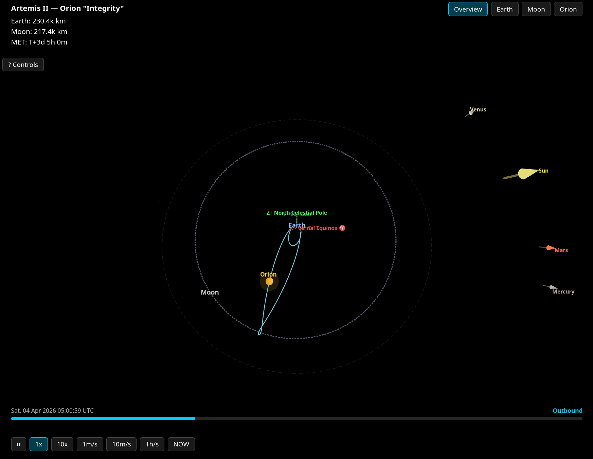

# Artemisee

Interactive 3D visualization of NASA's Artemis II lunar flyby mission, built with React Three Fiber and real JPL Horizons ephemeris data.




## Features

- **Real trajectory data** from JPL Horizons API (spacecraft ID -1024)
- **3D Earth, Moon, and Orion spacecraft** with correct positions
- **Hermite spline interpolation** using position + velocity vectors for smooth 60fps animation between 30-minute data points
- **Moon position** computed client-side via `astronomy-engine` (no API calls)
- **Earth rotation** synced to Greenwich Apparent Sidereal Time
- **Celestial direction markers** for Sun, Venus, Mars, Mercury
- **Moon orbit** and ecliptic reference ring
- **J2000 ECI axis guides** with astronomical labels
- **Playback controls** — play/pause, speed (1x to 1h/s), jump to now, time scrubber
- **Camera presets** — Overview, Earth, Moon, Orion with smooth transitions
- **DSN status** — live Deep Space Network antenna tracking (polls every 10s)
- **Mission stats** — distance from Earth/Moon, Mission Elapsed Time

## Tech Stack

| Layer | Technology |
|-------|-----------|
| 3D rendering | React Three Fiber + drei |
| Celestial math | astronomy-engine |
| Data fetching | @tanstack/react-query |
| State | zustand |
| API proxy | Express |
| Build | Vite + TypeScript |

## Quick Start

### 1. Clone and install

```bash
git clone https://github.com/w00jay/artemisee.git
cd artemisee
npm install
```

### 2. Configure the API proxy

Copy the example environment file and set your API server address:

```bash
cp .env.example .env
# Edit .env to set VITE_API_URL (defaults to http://localhost:4001)
```

### 3. Start the API server

The API server proxies requests to JPL Horizons (which blocks browser CORS) and the DSN Now XML feed.

```bash
# Run on the same machine:
npm run server

# Or with auto-reload:
npm run server:watch
```

If running the API server on a different machine, update `VITE_API_URL` in `.env` and ensure the port is accessible.

### 4. Start the frontend

```bash
npm run dev
```

Open http://localhost:5173

### 5. Run tests

```bash
npm test
```

## Architecture

```
Browser (Vite :5173)              API Server (:4001)
┌──────────────────┐              ┌──────────────────┐
│  React Three     │   /api/*     │  Express         │
│  Fiber scene     │ ──────────── │  ├─ /horizons    │ ──► JPL Horizons
│  + UI overlay    │  (proxied)   │  ├─ /dsn         │ ──► DSN Now XML
│  + zustand store │              │  └─ /health      │
└──────────────────┘              └──────────────────┘
```

- **Frontend** fetches trajectory data once, caches it, and interpolates at 60fps
- **astronomy-engine** computes Moon position and Earth rotation client-side (no API needed)
- **API server** caches Horizons responses for 30 minutes (ephemeris data is deterministic per navigation solution)

## Data Sources

- [JPL Horizons API](https://ssd.jpl.nasa.gov/horizons/) — spacecraft ephemeris (position + velocity vectors)
- [DSN Now](https://eyes.nasa.gov/apps/dsn-now/) — Deep Space Network antenna status
- [astronomy-engine](https://github.com/cosinekitty/astronomy) — Moon/planet positions, sidereal time
- [NASA AROW](https://www.nasa.gov/missions/artemis/artemis-2/track-nasas-artemis-ii-mission-in-real-time/) — official real-time tracker

## Coordinate System

The scene uses J2000 Earth-Centered Inertial (ECI) coordinates transformed to Three.js (Y-up):

| ECI Axis | Three.js | Direction |
|----------|----------|-----------|
| X | X | Vernal equinox |
| Y | -Z | 90° east in equatorial plane |
| Z | Y | North celestial pole |

Positions are scaled so 1 unit = 1 Earth radius (6,371 km). The Moon orbits at ~60 units.

## License

MIT — see [LICENSE](LICENSE).

Trajectory data from NASA/JPL is public domain. Planet textures from NASA are free to use with attribution.
